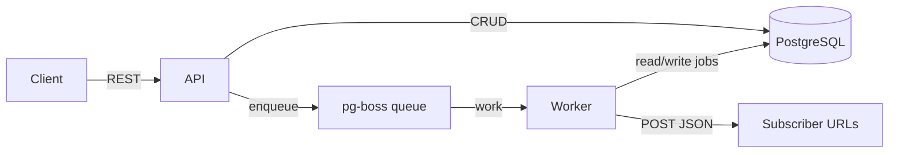

# Architecture

## High-level flow

The system implements a small event-driven integration platform: HTTP webhooks arrive at the API, are stored as durable jobs, processed asynchronously by a dedicated worker, and results are pushed to subscriber endpoints.

## Separation of concerns

- **API (`src/app.ts`, `src/api/*`)** exposes management and ingestion endpoints only. It never runs pipeline actions or subscriber HTTP calls. After validating input, it writes domain rows and publishes a lightweight message to pg-boss.
- **Worker (`src/worker/worker.ts`)** is the only component that transitions jobs through `processing`, executes modular actions, persists results, and performs outbound delivery with retries.
- **PostgreSQL** holds pipelines, subscribers, jobs, delivery audit rows, and pg-boss’s own queue tables. It is the source of truth for business data.
- **pg-boss** sits between API and worker so bursts of webhooks do not tie up HTTP threads and so crashes in processing do not lose work (within pg-boss retry policies).

## Why a queue?

- **Decoupling**: ingestion stays fast (`202 Accepted`) while CPU/IO-heavy work happens out of band.
- **Back-pressure**: pg-boss buffers work in the database instead of piling up in API memory.
- **Recovery**: if the worker dies mid-job, pg-boss can redeliver; the worker also treats already-`success` jobs as idempotent no-ops on duplicate delivery.

## Modules

| Area | Responsibility |
|------|------------------|
| `src/actions/*` | Pure transforms on JSON-like payloads (nested-safe). |
| `src/services/processor.ts` | Selects the action for a pipeline. |
| `src/services/queue.ts` | pg-boss lifecycle, queue creation, publish. |
| `src/services/delivery.ts` | Axios POST with exponential backoff + persistence per attempt. |
| `src/models/*` | Sequelize models and associations (CASCADE deletes where appropriate). |

## Observability extras

- Structured **Winston** logs on API and worker.
- **`GET /metrics`** exposes coarse job status counts for quick health dashboards.
